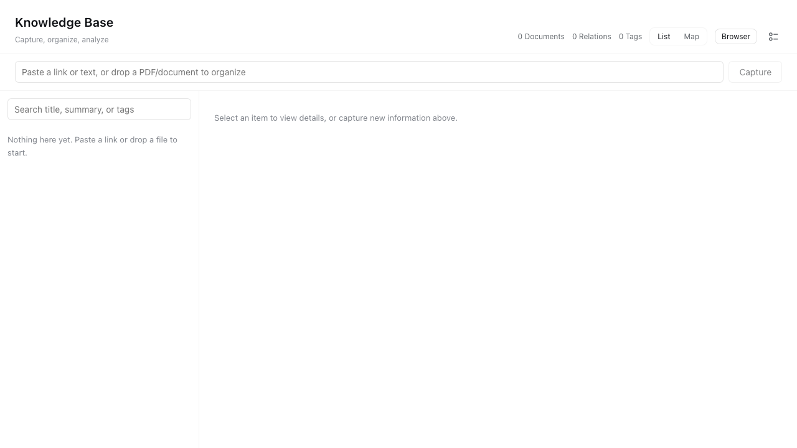

# Trellis

> A standalone academic and career workbench built on DeepSeek Harness.

Trellis is a local-first personal workbench that helps you collect job postings, contacts, courses, credits, competitions, and knowledge notes, and lets an agent archive, analyze, plan, and search them for you. All data stays in Trellis's own directories, so it never interferes with your DeepSeek Harness development environment.



## Features

- **Local-first storage**: SQLite database in `.trellis-data/`, easily exportable.
- **Isolated runtime**: Trellis uses its own `.trellis-home/`, completely separate from `~/.dsh`.
- **Auto-archiving**: Paste a URL or content and `trellis_archive` turns it into a structured note with a source record.
- **Career tracking**: job descriptions, contacts, applications, competitions, and scholarships.
- **Academic planning**: courses, degree requirements, term plans, and graduation forecasting.
- **Skill gap analysis**: compare target skills against your courses and notes to find what is missing.
- **Knowledge export**: export the whole knowledge base to JSON + Markdown for external review and backup.
- **Fully plugin-based**: built on DeepSeek Harness / Cordis, so every capability is a plugin.

## Quick Start

### Prerequisites

- Node.js `^22.19 || >=24`
- pnpm
- DeepSeek API Key (only needed for agent conversations; build and UI work without it)

### Install and Build

```bash
git clone https://github.com/GZ-November/trellis-web.git
cd trellis-web
pnpm install
pnpm run build
```

### Start Trellis Web

```bash
DSH_HOME=/absolute/path/to/trellis-web/.trellis-home \
pnpm dsh --profile trellis --patch examples/trellis/cordis.yml
```

Open http://127.0.0.1:3081.

> When running from the repository root, you can use:
>
> ```bash
> DSH_HOME=$PWD/.trellis-home pnpm dsh --profile trellis --patch examples/trellis/cordis.yml
> ```

### Configure the Model

Open **Settings → Models** in the Web UI and enter your DeepSeek API Key. All built-in Trellis tools only need DeepSeek API; no extra services are required.

## Data Isolation

| Directory | Purpose |
|---|---|
| `.trellis-home/` | Trellis's own DSH runtime configuration (profile) |
| `.trellis-data/` | Trellis's SQLite database and export files |
| `~/.dsh/` | Your DeepSeek Harness development environment (Trellis never writes to it) |

When you move the whole `trellis-web` directory to another machine, `.trellis-home/` and `.trellis-data/` move with it.

## Agent Tools

| Tool | Description |
|---|---|
| `trellis_archive` | Archive a web page or pasted content as a note and register its source |
| `trellis_job_import` | Import a job posting / JD |
| `trellis_job_list` | Query saved job postings |
| `trellis_contact_import` | Save a LinkedIn profile or contact |
| `trellis_application_upsert` | Track an application's status |
| `trellis_note_create` | Create a knowledge note |
| `trellis_link_note` | Add bidirectional links to a note |
| `trellis_course_upsert` | Upsert a course |
| `trellis_degree_requirement_upsert` | Upsert a graduation requirement |
| `trellis_academic_plan_upsert` | Upsert a term plan |
| `trellis_source_register` | Register a source such as a career page or course catalog |
| `trellis_competition_import` | Save a competition or scholarship |
| `trellis_search` | Search across all Trellis tables |
| `trellis_summary` | Summarize the state of the knowledge base |
| `trellis_export` | Export the knowledge base as JSON + Markdown |
| `trellis_skill_gap` | Analyze skill gaps against courses and notes |
| `trellis_graduation_forecast` | Estimate remaining credits and graduation time |
| `trellis_pipeline` | Show the application pipeline grouped by status |
| `trellis_deadlines` | List upcoming job and competition deadlines |
| `trellis_outreach_draft` | Generate a template outreach message for a contact |
| `trellis_course_recommend` | Recommend courses matching target skills |
| `trellis_auto_file` | Auto-classify and file raw content into the right table |

## Project Structure

```text
trellis-web/
├── .trellis-home/              # Trellis isolated DSH runtime
├── .trellis-data/              # Local data (not committed)
├── examples/trellis/           # Trellis launch overlay
├── packages/trellis/trellis/   # Trellis plugin (storage + tools)
├── apps/web/                   # Web frontend
└── assets/screenshots/         # README screenshots
```

## Tech Stack

- [DeepSeek Harness](https://github.com/deepseek-ai/deepseek-harness) — agent runtime
- Cordis — plugin framework
- SQLite — local storage
- React / Vite — web UI

## Design Philosophy

Trellis was designed around a few core ideas:

1. **It is a separate product, not a fork of DeepSeek Harness.** Trellis reuses DeepSeek Harness as its runtime and plugin system, but keeps its own identity, UI, data, and configuration.

2. **Data and development environments must never mix.** Trellis stores its runtime in `.trellis-home/` and its user data in `.trellis-data/`. Your existing `~/.dsh` environment stays untouched, which makes Trellis safe to experiment with and easy to move.

3. **Everything is a plugin.** Following DeepSeek Harness's philosophy, every Trellis feature is implemented as a Cordis plugin. This keeps the core upgradeable and makes it easy to add, remove, or replace capabilities.

4. **The agent should do the boring work.** Instead of manually organizing links, JDs, contacts, and course plans, the user pastes raw information and the agent structures it into the local knowledge base.

5. **Only DeepSeek API is required.** External integrations such as Gemini, Codex, or browser automation are optional. The core workflow works with a single DeepSeek API key.

6. **Local-first and portable.** All knowledge is stored in a local SQLite database and can be exported to JSON or Markdown. Moving Trellis to another machine moves the data with it.

7. **Built incrementally from real needs.** Trellis started as a simple storage plugin and grew into a workbench: archive → career tracking → academic planning → skill gap analysis → graduation forecasting → custom UI.

## Roadmap

- Web page fetching with `web_fetch` / browser MCP
- LinkedIn collection via manual export or browser automation
- HUSD course catalog crawler
- Interactive dashboard and knowledge preview UI
- Scheduled job / competition monitoring

## License

[MIT](LICENSE)

Trellis is an independent distribution built on DeepSeek Harness, which is also MIT licensed.
