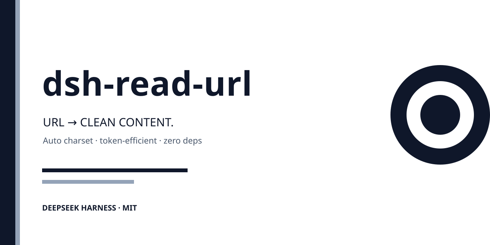

# dsh-read-url

🌐 [English](README.md) | **中文**



DeepSeek Harness 的 URL 阅读插件：抓取任意网页，**自动识别编码（GBK/GB2312/UTF-8/Big5）**，提取干净正文，输出**省 token 的紧凑文本或结构化 Markdown**。

零依赖（Node 20+ 内置能力），免 API key，免服务端，装完即用。

## 为什么做它

DSH 的 Agent 能搜索（返回链接和片段），但缺"把 URL 读成干净正文"这一步。官方 `tool-web` 的 `web_fetch` 是**整页 turndown 转换**（导航/广告/侧栏全保留），默认上限 20 万字符——token 黑洞。本插件只返回模型真正需要的：**净化后的正文 + 必要元数据**，并默认截断。

### 同类插件对比（2026-08-15 实测源码/文档）

| 能力 | 官方 `tool-web` web_fetch | dsh-webfetch | dsh-scrape-webpage | **dsh-read-url** |
|---|---|---|---|---|
| 正文净化（容器级提取） | ❌ 整页渲染 | ⚠️ 标签级去噪，nav/footer 仍混入 | ⚠️ 自研，含噪音 | ✅ article/main 容器 + 噪音剥离 |
| 默认输出上限 | 200000 字符 | 50000 字符 | 30000 字符 | **6000 字符 + 段落级截断** |
| 中文 GBK/GB2312 | 视 provider | ⚠️ 未归一化，GB2312 易乱码 | ❌ 未处理 | ✅ 归一化 + 乱码回退 |
| 会话级缓存 | ❌ | ❌ | ❌ | ✅ 5 分钟 TTL |
| 走 `ctx.web` seam | ✅ 官方本体 | ❌ 全局 fetch | ❌ | ✅ 优先 seam，缺失回退 |
| `ctx.effect` 卸载清理 | ✅ | ❌ | ❌ | ✅ |
| 协作式超时（不暴露给模型） | ✅ | ⚠️ 自管 | ⚠️ 自管 | ✅ `timeoutMs` + `exec.signal` |
| 模型视角输出 | 整页 Markdown | 紧凑文本 | 15 字段 JSON | **紧凑文本（无需解析 JSON）** |
| 依赖 | 官方 | TS 需构建 | 零依赖 | 零依赖（JS ESM 即装即用） |
| 反爬/降级响应（UA 与 TLS 指纹） | ⚠️ Node 默认 UA，实测 https 被中间设备按 TLS 指纹拦截、百度返回无热搜的降级版 | ❓ 未披露 | ❓ 未披露 | ✅ 完整浏览器 UA，实测获取完整版页面（百度热搜正常） |

> 2026-08-16 实测（本机环境）：停用本插件后用官方 `web_fetch` 读 `https://www.baidu.com`——TLS 握手被中间设备按程序指纹拦截（退回 http 才成功），且百度对 Node UA 返回**服务端降级版**（热搜词条改由 JS 异步加载，静态 HTML 不含）；换回 `dsh-read-url` 后 https 正常、热搜完整可读。差异根因：请求的 UA 与 TLS 特征决定网站/中间设备是否按 bot 处理。

## 遵循 DSH 架构理念

按官方文档实现（`docs/capability-seams.md`、`docs/cordis-primer.md`、`docs/tool-execution-pipeline.md`）：

1. **网络访问走 `ctx.web` 能力缝**——所有 web 访问优先通过 `ctx.web.fetch()`（seam 内解析 provider，与官方 `tool-web` 一致），seam 缺失时回退全局 fetch。网络层可替换，不绑定任何具体 provider；
2. **可逆副作用**——会话缓存注册在 `ctx.effect` 下，插件卸载即自动清理（时间可组合性）；
3. **协作式工具调用超时**——`ToolDefinition.timeoutMs` 声明预算，`execute(args, exec)` 把 `exec.signal` 转发给 fetch，超时策略由管线强制执行，不把超时暴露给模型；
4. **模型视角精简**——render 输出紧凑文本（`title:` 头部 + 正文），模型直接消费，无需解析 JSON；默认参数最省 token，结构化能力按需开启。

## 安装

```bash
# 从 GitHub（推荐，便于更新）
npx @deepseek-ai/dsh plugin --profile web add github:2672243194/dsh-read-url

# 本地开发
npx @deepseek-ai/dsh plugin --profile web add ./dsh-read-url
```

重启 DSH（Web/TUI）后，设置 → 插件列表应看到 `dsh-read-url` 已启用。

## 使用

直接对话：

```
帮我读一下 https://example.com/article 并总结要点
用 markdown 格式读 https://docs.example.org/guide
同时读一下这几个网址，对比它们的观点：<url1> <url2> <url3>
```

### 工具

**`read_url(url, maxChars?, offset?, mode?, includeLinks?)`** — 抓取并提取干净正文

| 参数 | 类型 | 默认 | 说明 |
|---|---|---|---|
| `url` | string | 必填 | http(s) URL |
| `maxChars` | number | 6000 | 返回正文最大字符数（500–20000） |
| `offset` | number | 0 | 从该字符偏移续读（长文续段，命中缓存不重复前文） |
| `mode` | string | `text` | `text` = 纯文本（最省 token）；`markdown` = 结构化 |
| `includeLinks` | boolean | `false` | 额外返回页面内最多 20 条链接（标题+URL） |

**`read_url_batch(urls, maxChars?, mode?, includeLinks?)`** — 批量读多个 URL（1–10 个），并行、逐页净化，合并成一个紧凑报告

| 参数 | 类型 | 默认 | 说明 |
|---|---|---|---|
| `urls` | string[] | 必填 | http(s) URL 列表（1–10 个） |
| `maxChars` | number | 3000 | 每页返回正文最大字符数（500–20000） |
| `mode` | string | `text` | `text` = 纯文本；`markdown` = 结构化 |
| `includeLinks` | boolean | `false` | 每页额外返回链接（标题+URL） |

- 并发 4 限制（防目标站限流），单页失败**不影响其他页**（结果里标注 `[失败]` + 原因）；
- 复用 `read_url` 的全部能力与缓存：编码识别、正文净化、SPA 渲染、5 分钟缓存（重复批量读直接命中）。

**`read_url_site(url, maxPages?, maxDepth?, includeContent?, maxCharsPerPage?)`** — 整站递归爬取：从入口 URL 出发，BFS 发现同域名页面，返回紧凑站点地图

| 参数 | 类型 | 默认 | 说明 |
|---|---|---|---|
| `url` | string | 必填 | http(s) 入口 URL |
| `maxPages` | number | 15 | 最多爬取页数（2–50，防 token 爆炸） |
| `maxDepth` | number | 2 | 最大链接深度（1–5） |
| `includeContent` | boolean | `false` | 每页附短正文摘要（默认关——结构优先，省 token） |
| `maxCharsPerPage` | number | 500 | includeContent 时每页摘要长度（200–2000） |

- **只爬同域名**；登录/API/静态资源路径自动跳过；URL 去重（去 fragment）；
- 并发 2 对目标站友好；单页失败记录 `[失败]` 不影响整体；
- 输出为缩进树：`[深度] 标题 (字符数) URL`；
- **不做 SPA 渲染**（整站是轻量批量抓取，渲染每页 1s+ 太慢）——SPA 页请用 `read_url` 单读。

**`read_url_links(url, limit?)`** — 只列出页面链接清单，不返回正文（更轻，适合找来源/摸站点结构）

| 参数 | 类型 | 默认 | 说明 |
|---|---|---|---|
| `url` | string | 必填 | http(s) URL |
| `limit` | number | 20 | 最多返回链接数（1–50） |

### 配置（可选）

插件级配置通过 profile 的 `cordis.patch.yml` 覆盖（默认值见插件自带 `cordis.patch.yml`）：

```yaml
- id: dsh-read-url
  config:
    timeoutMs: 15000      # 单请求超时
    maxBytes: 3145728     # 响应体上限（字节）
    maxChars: 6000        # 默认正文截断
    maxLinks: 20          # read_url_links 默认条数
    spaRender: true       # SPA 渲染增强（需 playwright 已安装，未装自动降级提示）
    userAgent: '...'      # 请求 UA
```

### 输出结构（紧凑）

```json
{
  "url": "...",
  "title": "...",
  "siteName": "...",
  "lang": "zh-CN",
  "charset": "gbk",
  "mode": "text",
  "truncated": true,
  "charsTotal": 12990,
  "charsReturned": 6000,
  "text": "……",
  "links": []          // 仅 includeLinks=true 时
}
```

### PTC 模式

输出是纯 JSON、可组合，PTC 模式下一次编排多 URL 并行读取：

```ts
const results = await Promise.all([
  read_url({ url: 'https://a.example.com', maxChars: 4000 }),
  read_url({ url: 'https://b.example.com', maxChars: 4000 }),
])
```

## 省 token 设计（核心）

1. **默认只给正文**——不返回 headings/keywords/images/字数统计等冗余字段，需要时按参数取；
2. **段落级智能截断 + offset 续读**——默认 6000 字符（约 3000 token），在段落边界截断保证语义完整，输出行仅一行 `(chars 6000/12990 — 截断，offset 续读)` 引导；续读从指定偏移开始、命中缓存切片，**不重复返回已读前文**（实测 0+500 → 500+500，无重复）；offset 越界返回空而非重复开头；
3. **text 模式优先**——Markdown 结构按需开启；
4. **紧凑文本 render**——模型直接看到 `title:` 头部 + 正文，无需解析 JSON；`siteName` 与域名相同时省略；状态提示全部一行内（截断/续读/缓存/渲染标记），无长段落废话；
5. **双层缓存**——成功结果按 URL 缓存 5 分钟（重复读取直接命中，省网络也省模型重试）；**失败结果缓存 30 秒**（坏 URL 不会触发重复 fetch 循环）；
6. **KV Cache 友好（DeepSeek 成本特调）**——工具 schema/description 保持**静态文本**（不嵌入配置值），配置变更不会使可复用的 prompt 前缀失效，KV 缓存持续命中。DeepSeek 缓存命中 token 价格约为未命中的 1/10，前缀越稳定越省钱（官方 `tool-web` 文档同款分析）；
7. **批量共用缓存**——`read_url_batch` 内部复用同一套缓存，重复批量读直接命中，且每页默认 3000 字符（低于单页 6000）控制总量；
8. **固定开销压缩**——4 个工具 description 合计约 990 字符（有断言守卫，保持静态利于 KV 缓存）；HTML 实体解码扩展至 45 个命名实体，`&mdash;`/`&hellip;` 等残留不再浪费 token 或显示为乱码。

## 技术说明

- **编码**：HTTP `Content-Type` charset → HTML meta → BOM 三级探测，内置 `TextDecoder` 转码（Node 20+ full-icu），GB2312 归一为 GBK，检测到乱码自动回退 UTF-8；
- **正文提取**：优先 `<article>` / `role="main"`，剥离 `nav/footer/header/aside/form/iframe` 及广告类容器，启发式回归到 `<body>`；
- **Markdown**：自研轻量标签状态机（标题/段落/列表/引用/代码块/表格/行内加粗斜体链接），零依赖；
- **安全**：仅 http/https；不执行页面脚本；响应超 3MB 拒绝；15s 超时；错误信息结构化返回（HTTP 状态/超时/类型不支持/DNS 归因如 `getaddrinfo ENOTFOUND` vs 被墙超时）；
- **网络回退（代理，并发竞速）**：检测到代理时（环境变量 `HTTPS_PROXY`/`HTTP_PROXY` → **Windows 系统代理**注册表，Clash 类软件的真正落点），插件**同时发起**直连 fetch 与代理 curl（`-x` 显式传参，零 npm 依赖），**先完成且成功者胜**——海外站（直连被墙）经用户自己的代理 ~0.6s 读到，不再等直连超时兜底（实测 11s → 633ms，-94%）。输者立即 abort（curl 进程 kill / fetch 中止），**结果从不进入模型上下文，token 消耗零变化**。双方均失败时返回原始直连错误并注明代理尝试（`已尝试代理 …`）；无代理配置时退化为纯直连（行为与 v0.4.3 完全一致）；
- **隐私**：插件**绝不使用开发者的任何网络配置**——代理回退只在运行时读取**你自己机器**的代理（环境变量或 Windows 系统代理）。无遥测、无统计、无数据收集：唯一的对外动作就是抓取你让它读的那个 URL；
- **可选增强一（Firefox Reader Mode 算法）**：在 DSH profile 目录执行 `npm i @mozilla/readability happy-dom` 后自动启用，正文提取升级为 `@mozilla/readability`（MPL-2.0，引用不改写），未安装时回退内置启发式提取器，核心保持零依赖；
- **可选增强二（SPA 页面渲染）**：在 DSH profile 目录执行 `npm i playwright && npx playwright install chromium` 后自动启用。检测到正文为空且页面脚本密集（疑似 Vue/React 客户端渲染）时，自动用无头 Chromium 渲染后再提取（`rendered` 标记告知模型）；渲染采用 `domcontentloaded` + **DOM 稳定轮询**（内容停止增长即收，上限 10s）而非 `networkidle`——心跳轮询站永不空闲，避免 30s 超时；未安装时优雅提示安装方法、不报错——核心保持零依赖；
- **边界**：登录墙页面无法读取；SPA 页面需安装 Playwright 增强后渲染读取（未安装时返回明确提示）；**结构化数据（如评论的点赞数归属、榜单数值）不在文本提取范围**——本插件把 HTML 扁平化为可读文本，字段与数值的精确对应关系会丢失；需要精确字段时，用 Playwright 拦截页面实际调用的数据 API 获取（见下方「真实世界验证」）。

## 真实世界验证（2026-08-18，v0.4.5）

29 站全量实测（`multi-site.mjs` 已提交可复跑）：**18 OK / 3 预期边界 / 8 网络·反爬边界 / 0 崩溃**（总耗时 109s，海外站含约 11s 直连超时后代理回退）。

| 类别 | 站点 | 结果 |
|---|---|---|
| 门户导航净化 | 百度 / 腾讯 / 网易 / 新浪 / 豆瓣 / CSDN / 搜狐 / 凤凰 | ✅ 干净正文，无 CSS 噪音 |
| **SPA 渲染** | B 站 / 小黑盒 / 掘金 / QQ 新闻 / 少数派 | ✅ `rendered` 标记 + JS 执行后正文 |
| 多 article 聚合 | 博客园 / 阮一峰博客 | ✅ 800+ 字符多篇聚合 |
| 静态文档页 | MDN / 阮一峰 / example.com / GitHub | ✅ 干净提取（example.com 简单页，预期） |
| 登录墙 | 知乎 / 微博 | ✅ 清晰内容或空（预期） |
| **代理回退（海外站）** | BBC 中文 / V2EX | ✅ 直连被墙 → 自动经系统代理重试 → 干净正文 |
| 网络·反爬边界 | W3C（对 Chrome UA 403）；维基（代理 403）；httpbin（503 服务端故障）；PDF（404）；DNS 失败（代理未连通） | ✅ 错误全部准确归因（HTTP 状态/403/503/ENOTFOUND），非插件缺陷 |
| **offset 续读** | 新浪新闻（12284 字符） | ✅ 800+800 无缝衔接、命中缓存 |
| **批量 + 失败隔离** | 4 URL 混合 | ✅ 2/4 成功、失败隔离 |
| **整站爬取** | 阮一峰博客 | ✅ 5/5 页树状站点地图 |

- **36 个零依赖断言**（含实体解码、description 预算守卫、链接去重、表格分隔行转义、代理回退函数、空参容错、竞速逻辑）+ **10 个 SPA 测试断言**全绿；
- 一个真实案例：小黑盒帖子的评论点赞数（`up` 字段）无法从扁平文本确定归属——**精确字段应走页面背后的数据 API**（如 `/bbs/app/link/tree` JSON），这是同类文本提取器的共同边界，不是缺陷。

## Roadmap

- [x] 单页多段续读（`offset` 参数）
- [x] SPA 页面按需渲染（可选 Playwright 增强，装浏览器后自动启用）
- [x] 批量读取（`read_url_batch`）
- [x] 整站递归爬取（`read_url_site`）

## 开发

```bash
node test.mjs          # 零依赖自测（转码/提取/Markdown/截断/批量/站点爬取/缓存隔离）

# SPA 渲染真实测试（需 playwright 已安装，未装自动 SKIP）
node test-spa.mjs      # 10 断言：JS 正文/渲染后链接/工具不崩溃/缓存隔离

# 29 站真实世界验证（需联网）
node multi-site.mjs    # 门户/SPA/登录墙/静态/反爬/网络边界，输出分级结果

# 端到端验证（需已安装 DSH CLI）
npx @deepseek-ai/dsh plugin --profile headless add .        # 在插件目录的上一级执行
npx @deepseek-ai/dsh --profile headless "用 read_url 读取 https://example.com 并输出标题"
```

已通过 DSH v0.1.0-rc.6 真实运行验证：插件加载、`read_url` 注册、模型调用、真实页面返回全部正常。

## 支持

如果 dsh-read-url 对你有帮助，欢迎在 [GitHub](https://github.com/2672243194/dsh-read-url) 点个 ⭐ Star。

- 完全免费开源（MIT），零依赖、免 API key、纯本地处理、不收集任何数据；
- 独立开发维护，Star 数量是我判断是否继续投入迭代的直接依据；
- 用的人越多，功能越完善——下一个功能很可能就是你需要的那个。

一个 Star 不花一分钱，但能让这个项目走得更远。谢谢 ⭐

## License

MIT
